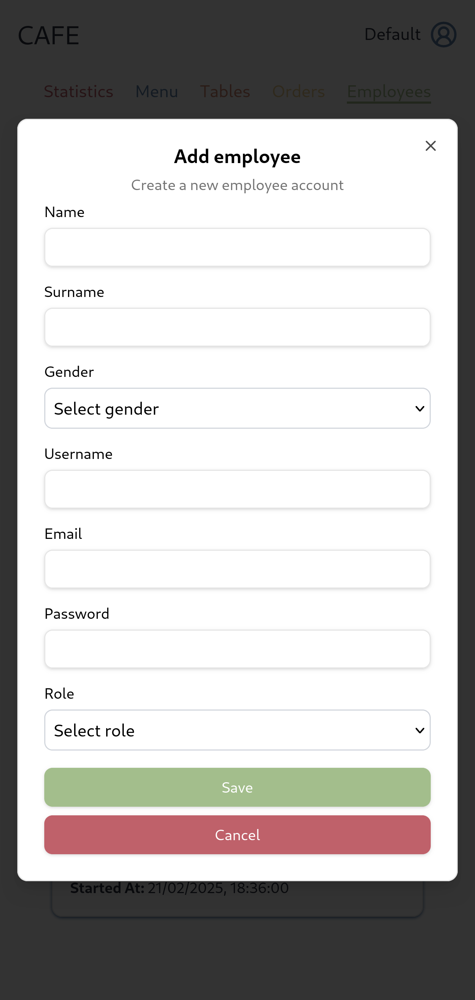
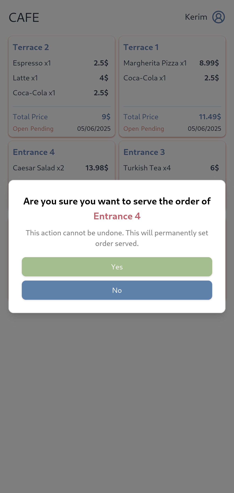

# 🍽️ Cafe Order App

A modern, multi-role restaurant management system built with **React**, **Vite**, **TailwindCSS**, and **ShadCN UI**, featuring admin, waiter, cashier, and client interfaces. This app allows seamless ordering, employee management, and performance tracking through a clean and interactive dashboard.

---

## 🚀 Tech Stack

- **Frontend**: React, Vite, TailwindCSS, ShadCN UI
- **Backend**: Golang (API must be running separately)
- **Routing**: React Router
- **Styling**: TailwindCSS + ShadCN components
- **State Management**: React Hooks

## 👥 Roles and Features

### 🧑‍🍳 Admin Panel
- **Dashboard** with statistics for employees and orders.
- **Employees**: Create, delete, and view statistics.
  - Roles: `waiter`, `cashier`
- **Menu**: Add/remove items with images.
- **Tables**: Create/delete tables with dynamic ordering URLs:
  ```
  http://www.domain.com/order/{tableId}
  ```
- **Orders**: View and filter all order details.
- **Statistics**:
  - **Waiters**: Orders served, avg. serving time, total served.
  - **Cashiers**: Revenue collected, orders closed.

> ⚠️ Some pages like employee statistics and order page are partially implemented.

---

### 💸 Cashier Panel
- View **active orders**.
- Close orders **after payment**, only if served.

---

### 🧾 Waiter Panel
- View all **assigned orders**.
- Mark orders as **served**.

---

### 🍽️ Client Interface
- Visit table-specific order link (e.g. `/order/{tableId}`).
- Browse menu.
- View item details.
- Add to cart.
- Submit order.

---

## 🖼️ Screenshots

| Login | Admin - Employees |
|---------------|-------------------|
|  |  |

| Admin - Add Employee | Admin - Employee Details |
|----------------------|--------------------------|
|  |  |

| Admin - Menu | Admin - Add Menu Item |
|--------------|------------------------|
|  |  |

| Admin - Tables | Admin - Add Table |
|----------------|-------------------|
|  |  |

| Admin - Orders | Admin - Statistics |
|----------------|---------------------|
|  |  |

| Cashier - Orders | Cashier - Order Details | Cashier - Close Order |
|------------------|--------------------------|------------------------|
|  |  |  |

| Waiter - Orders | Waiter - Order Details | Waiter - Serve |
|-----------------|------------------------|----------------|
|  |  |  |

| Client - Menu | Client - Item Details | Client - Cart | Client - Active Order |
|---------------|------------------------|---------------|------------------------|
|  |  |  |  |

---

## ✅ Status

- ✅ Core functionality working across all roles
- 🚧 Employee statistics and detailed admin order page are in progress
